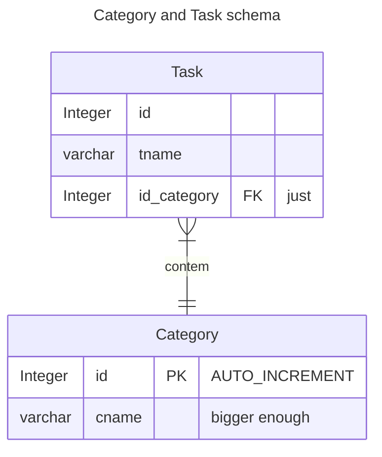
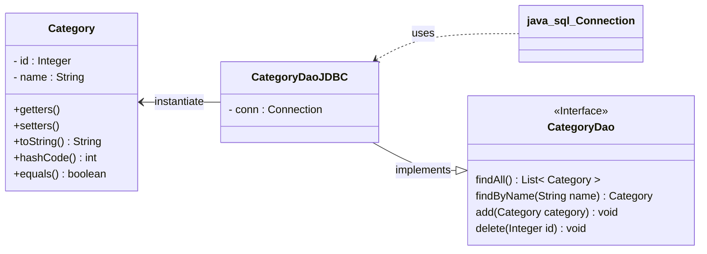
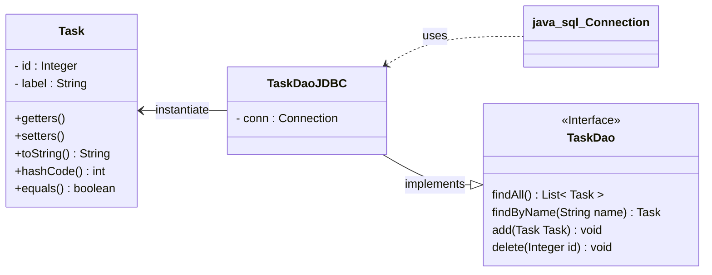

# ToDo List App

<p>todo list app made with java, standard swing and mysql </p>

### Requirements
- JDK (Java 17)
- MySQL


### Build and run
1. create a <strong>db.properties</strong> file in the root dir.
2. follow the pattern below: 

```console
user=<your_mysql_user>
password=<your_password>
dburl=jdbc:mysql://localhost:<mysql_port>/<name_of_ur_database>
useSSL=false
```
><p>note: by default mysql uses root as user, no password, and port 3306.</p>

3. execute the [sql script](https://github.com/kevindotklein/todolist-app/blob/main/setup/setup.sql).

<br>

### Todo
- [ ] automate the setup process.


## Database Schema



## Project class diagram






